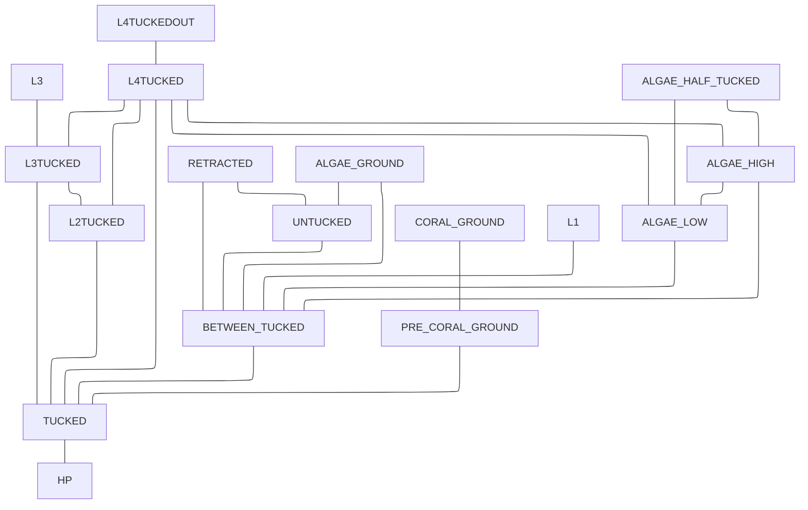

# Superstructure Graph

```mermaid
%%{init: {"flowchart": {"defaultRenderer": "elk"}} }%%
graph TD;

HP

TUCKED --- HP
L2TUCKED --- TUCKED
L3TUCKED --- TUCKED
L3TUCKED --- L2TUCKED
L3 --- L3TUCKED
L4TUCKED --- TUCKED
L4TUCKED --- L3TUCKED
L4TUCKED --- L2TUCKED
L4TUCKEDOUT --- L4TUCKED

BETWEEN_TUCKED --- TUCKED

UNTUCKED --- BETWEEN_TUCKED

PRE_CORAL_GROUND --- TUCKED
CORAL_GROUND --- PRE_CORAL_GROUND
RETRACTED --- UNTUCKED
RETRACTED --- BETWEEN_TUCKED

L1 --- BETWEEN_TUCKED

ALGAE_GROUND --- BETWEEN_TUCKED
ALGAE_GROUND --- UNTUCKED
ALGAE_LOW --- BETWEEN_TUCKED
ALGAE_HIGH --- BETWEEN_TUCKED
ALGAE_HIGH --- ALGAE_LOW

L4TUCKED --- ALGAE_HIGH
L4TUCKED --- ALGAE_LOW

ALGAE_HALF_TUCKED --- ALGAE_HIGH
ALGAE_HALF_TUCKED --- ALGAE_LOW
```
